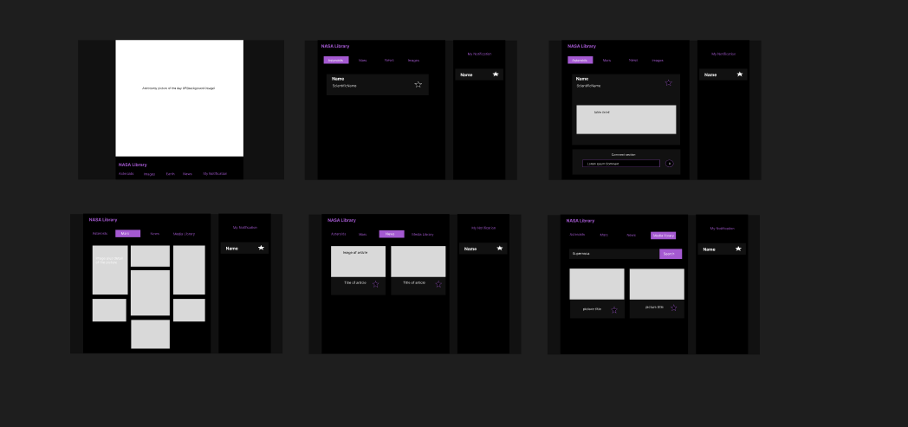
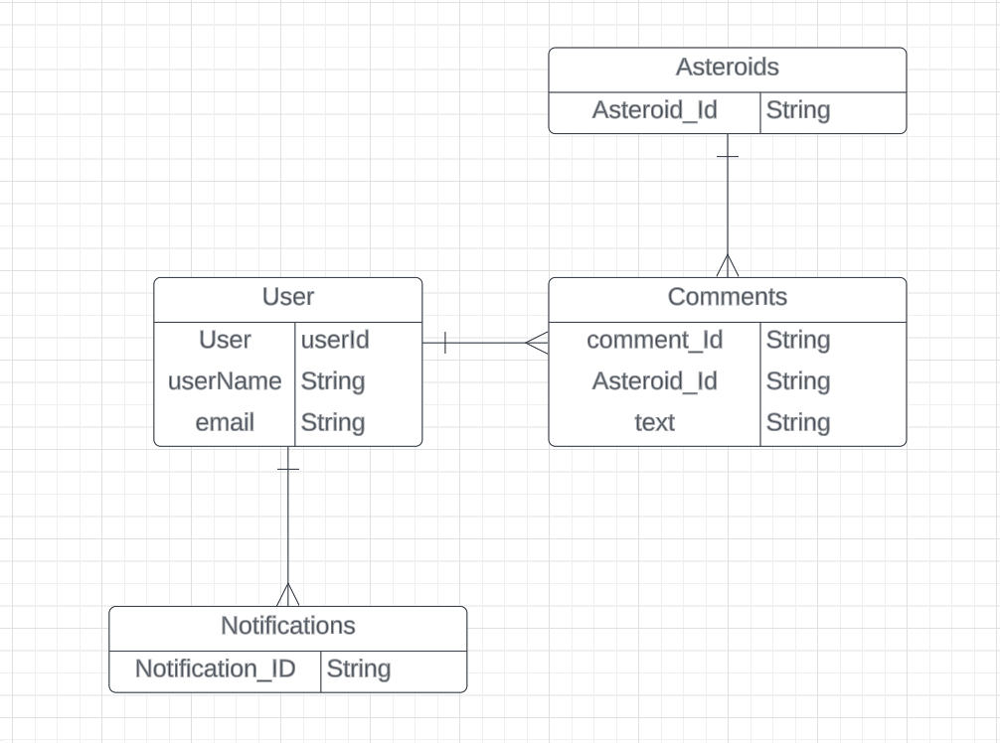
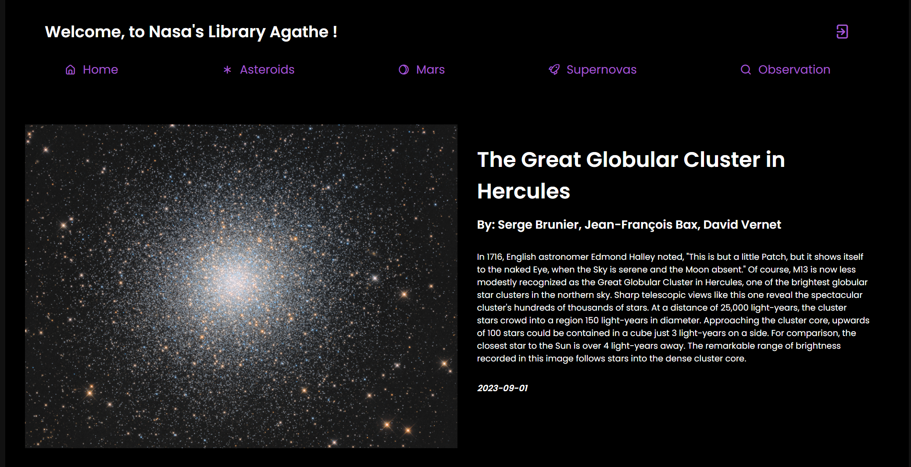
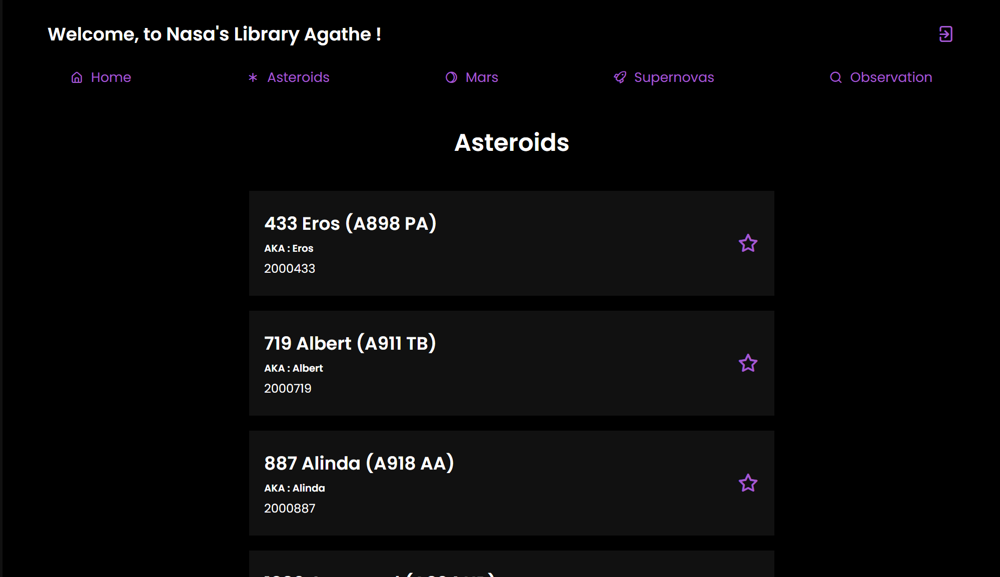
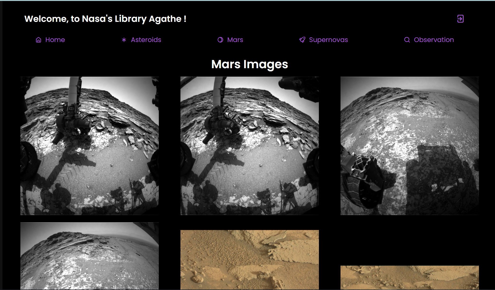
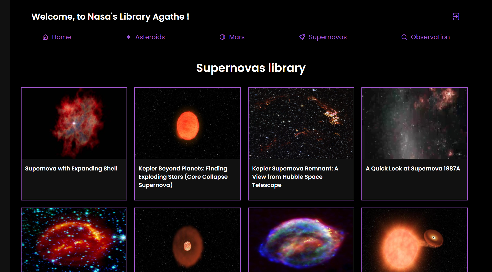
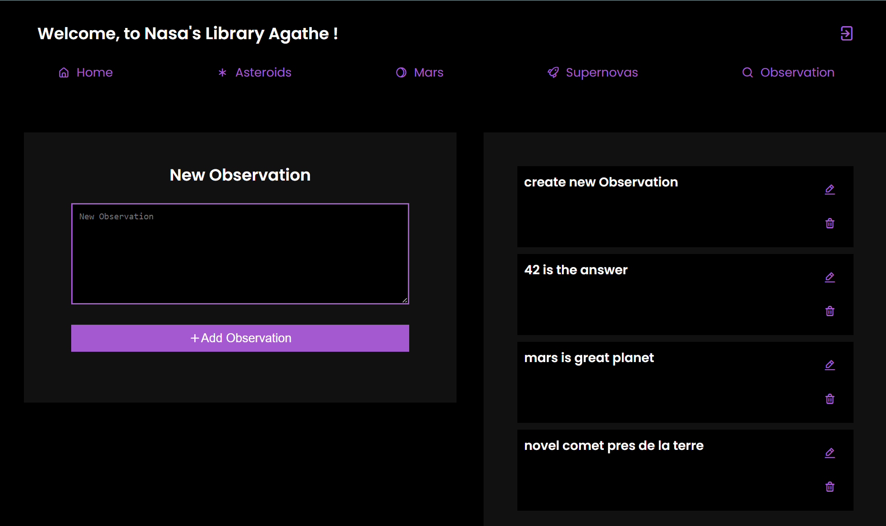

# Nasa Library

## About this project

Nasa Library is a solo project. It is a fullstack MERN and CRUD webapp. There is 3 different API from the [Nasa Website](https://api.nasa.gov/), and my own API for the CRUD functionality.
Every User can make a personal account by Signing up and Login.
This Website is a small Nasa library presenting: APOD ( Astronomic Picture Of the Day ) in the Home page, all Asteroids close to the Earth's Data, Mars images from _Curiosity_ , Supernovas Data and images and a Observations page to make personal notes.

## Wireframe

Here is the Wireframe I followed for this project:

## ERD

Here is the ERD I followed for this project:

## Trello

Also the link to my [trello board](https://trello.com/c/Q5jvophe/21-erd).

## Result

## Technology Used

1. HTML,
2. CSS,
3. JavaScript,
4. React, 
5. Express, 
6. Node, 
7. MongoDB , 
8. Nasa APIs.

## Challenges

It was more difficult than I thought.I wasn't able to implement any of the IceBox features for my project. I was able to create my MVP, but as the week went by, I had to make the project a bit lighter to stay on track. The CRUD functionality was challenging, yet it was the best part of the project as I got to learn more about React. It also provided good practice with MongoDB, Mongoose, and Express.

## Future Opportunities

Complete all the IceBox of my Trello board, such as :

	* a spinner/loader while the data of the APi is being fetch, 
	* add pagination for the Supernova and Asteroid pages,
	* add Download image functionality,
	* do a search bar from Nasa library, filter the Nasa Data and render the search result,
	* do the mediaquery ( Some parts of the website is already responsive, but not the Navbar ).

